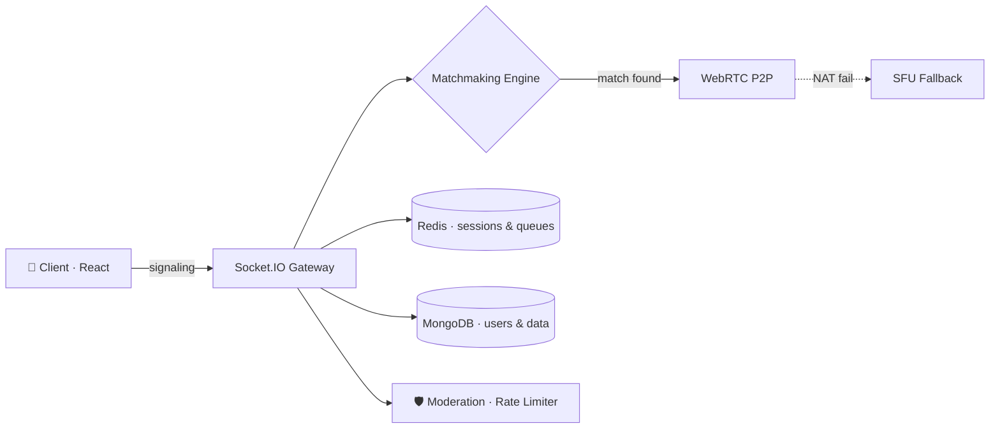

<div align="center">

[](https://anyeria.xyz)


[](https://github.com/skvprogrammer?tab=followers)
[](https://anyeria.xyz)
[](https://satyamkumarverman.xyz)

</div>

---

## 👨‍💻 whoami

```bash
$ whoami
satyam — self-taught full-stack developer | open source contributor | system design nerd

$ cat skills.txt
MERN · WebRTC · Socket.IO · Flask · Redis · Docker · DSA · OS · Networking · DBMS · System Design

$ cat mission.txt
Build real-time systems that scale, solve hard problems, and ship fast with AI as a force multiplier.

$ echo $STATUS
🟢 Open to full-time roles, freelance work & collaborations
```

I'm a self-taught software engineer with strong foundations in **Data Structures, OS, Networking and DBMS**, specialising in production-style applications that handle **real-time data at scale**. I love computers more than humans (just ask my code), keyboard shortcuts are my love language, and I ship one commit at a time.

---

## ⚡ Impact at a glance

<div align="center">

| 👥 **20K+** | 🏅 **Top 125** | ✅ **500+** | 🔀 **6 PRs** | 🧱 **4** |
|:---:|:---:|:---:|:---:|:---:|
| concurrent users designed for in Anyeria's backend | LeetCode Weekly Contest 477 | DSA problems solved | merged: 5 freeCodeCamp + 1 CPython | shipped projects live |

</div>

---

## 🚀 Current focus

| | |
|---|---|
| 🔨 **Building** | [Anyeria](https://anyeria.xyz) (formerly Omezle): WebRTC video, audio and text platform, now with premium features |
| 🏗️ **Architecting** | Microservices split for scalability and fault tolerance |
| 🧠 **Learning** | Cloud architecture, containerisation and orchestration, event-driven design, advanced system design |
| 🤖 **Exploring** | LLM APIs, AI moderation, smart matchmaking, agent workflows (tool use / MCP) |
| 🧮 **Solving** | Graph algorithms, dynamic programming and optimisation |
| 🌐 **Researching** | Web3, smart contracts and decentralised apps |
| 🌍 **Contributing** | freeCodeCamp and CPython |

---

## 🎯 Featured project: Anyeria

[](https://anyeria.xyz) [](https://github.com/skvprogrammer/omezle-chat)

> A scalable, real-time video chat platform built from the ground up to handle massive concurrent traffic. *(Formerly **Omezle**.)*

**What's inside**

- 🎥 **WebRTC** peer-to-peer video streaming with **SFU fallback** architecture
- 🔄 **Real-time matchmaking engine** using Socket.IO and custom algorithms
- 📊 Backend infrastructure designed for **20K+ concurrent users**
- 🛡️ **Moderation system**, rate limiting and session management
- 💬 Video, audio, text, voice rooms, reconnect, friends, spectator modes
- ⭐ Premium features tier
- 🚀 Backend on **Railway**, frontend on **Vercel**, containerised with **Docker**
- 🔧 Currently architecting **microservices** for scalability and fault tolerance



**Stack:** `MongoDB` · `Express.js` · `React` · `Node.js` · `WebRTC` · `Socket.IO` · `Redis` · `Docker` · `Railway` · `Vercel`

---

<details>
<summary><b>🧩 More projects (click to expand)</b></summary>

### 🖥️ [Terminal Theme Portfolio](https://satyamkumarverman.xyz)
An interactive, CLI-inspired portfolio where visitors type commands to explore sections. A different take on portfolio UX. **React · Vercel**

### 🔗 URL Shortener API
Production-style URL shortening service with a clean, minimal frontend. Covers RESTful API design, data validation and deployment best practices. **Python · Flask · REST · Vercel**

### ⏱️ Pomodoro Timer
WebSocket-enabled productivity timer with session tracking and real-time sync across multiple browser tabs. **Python · Flask · WebSockets · React · Vercel**

</details>

---

## 🤖 How I work in the AI era

> AI doesn't replace engineers who understand the stack. It multiplies them.

- ⚙️ **AI-assisted development**: Claude, ChatGPT and Gemini for scaffolding, refactors, test generation and debugging. I review every diff.
- 🧠 **AI inside products**: LLM APIs from Node and Python backends, structured JSON outputs, prompt design, cost and latency trade-offs.
- 🛡️ **Applied ideas for Anyeria**: AI-assisted moderation, smarter matchmaking, abuse detection.
- 🧱 **Fundamentals as the edge**: networking, OS, DBMS and DSA are how I know when the AI is wrong.

---

## 🛠️ Tech arsenal

**Languages**
    

**Frontend**
    

**Backend & Databases**
      

**DevOps & Tools**
      

**AI Tools**
  

<details>
<summary><b>📋 Skills matrix</b></summary>

| Category | Skills |
|----------|--------|
| **Frontend** | React, HTML5/CSS3, ES6+, WebRTC, WebSockets, Responsive Design |
| **Backend** | Node.js, Express.js, Flask, REST API Design, System Design |
| **Databases** | MongoDB, PostgreSQL, MySQL, Redis |
| **DevOps** | Docker, Linux (Ubuntu/CLI), Git, Vercel, Railway, Render |
| **CS Fundamentals** | DSA, OS, Networking, DBMS, System Design (HLD and LLD), OOP |
| **Tools & Productivity** | ChatGPT, Claude, Google Gemini, Postman, Linux CLI |

</details>

---

## 🏆 Achievements

### 🥇 Competitive programming
- **LeetCode Rank 125**, Weekly Contest 477
- **LeetCode Rank 453**, Biweekly Contest 170
- **500+ DSA problems** across LeetCode and HackerRank

### 🌍 Open source
- **freeCodeCamp**: 5 pull requests merged into the main curriculum
- **CPython**: 1 PR merged into the official Python interpreter (documentation)

### 🎓 Certifications & training
- C++ Programming, Beginner to Advanced (Udemy)
- Software Engineer Role Certification
- Penetration Testing Certification
- Java, Python and SQL (HackerRank)

<div align="center">

[](https://leetcode.com/u/skvprogrammer)
[](https://www.hackerrank.com)

</div>

---

## 📈 GitHub analytics

<div align="center">


</div>

---

## 📚 Learning roadmap

```text
[██████████] MERN / Real-time (WebRTC, Socket.IO)   ✅ shipped
[████████░░] System design and microservices         🔄 in progress
[███████░░░] Cloud, containers, orchestration        🔄 in progress
[██████░░░░] Advanced DSA (graphs, DP)               🔄 in progress
[█████░░░░░] LLM apps and agents                     🚀 exploring
[███░░░░░░░] Web3 and smart contracts                🔭 researching
```

---

## 🎬 Fun facts

- 💻 I love computers more than humans (seriously, just ask my code)
- ⌨️ Keyboard shortcuts are my love language
- 🚀 Currently obsessed with building systems that scale
- 🎯 One commit at a time, changing the world

---

## 🌐 Let's connect

<div align="center">

[](mailto:satyamkumarverman@gmail.com)
[](https://www.linkedin.com/in/satyam-kumar-verman-b77272190/)
[](https://github.com/skvprogrammer)
[](https://twitter.com/skvprogrammer)
[](https://satyamkumarverman.xyz)

**Let's build something amazing together! 🚀**

<sub>Open to collaborations, freelance work and exciting projects. Feel free to reach out!</sub>


</div>
